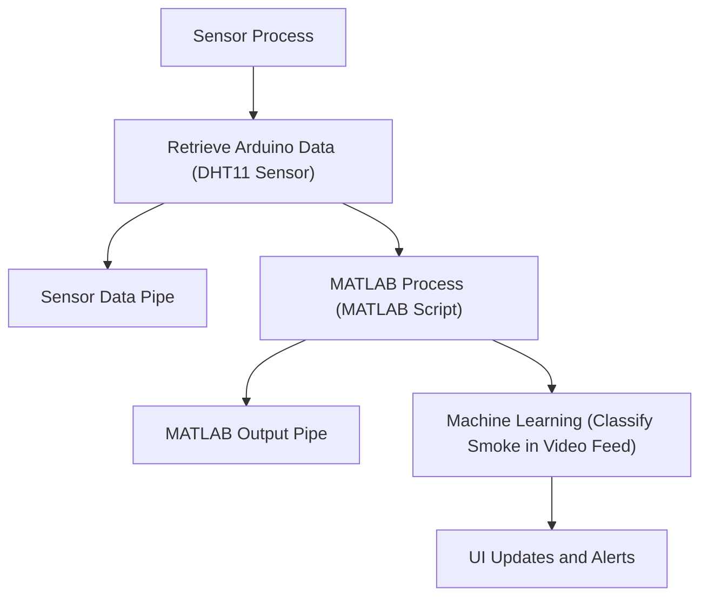

# Project Report: Wild fire Sensor with Smoke Detection using AI

## 1. **Project Goals**
The primary goal of this project is to develop an integrated environmental monitoring system capable of detecting potential wildfire risks in real-time. The system leverages data from environmental sensors (temperature and humidity) and a machine learning model to detect smoke in the surroundings. The system will provide alerts for high fire risk and smoke detection and present this information through a graphical user interface (GUI). The key objectives of the project are:

- To collect and process environmental sensor data (temperature and humidity).
- To perform real-time smoke detection using a pre-trained machine learning model (AlexNet).
- To visualize the data in a GUI for real-time monitoring.
- To provide timely alerts for smoke detection and fire risk.
- To integrate data from both Arduino-based environmental sensors and MATLAB-based smoke detection.

## 2. **Significance and Novelty of the Project**
Wildfires are a growing environmental threat, and early detection can significantly reduce the damage caused by these events. This project is significant because it combines both physical environmental sensing and advanced machine learning to detect and respond to wildfire threats. 

The novelty lies in the integration of real-time environmental monitoring with a machine learning model for smoke detection, along with a user-friendly GUI. This system uses an Arduino-based DHT11 sensor for temperature and humidity readings and combines it with an AlexNet-based transfer learning model to detect smoke through a camera feed. The integration of these components into a single, automated solution makes it a comprehensive tool for fire risk assessment.

## 3. **Installation and Usage Instructions**
### Prerequisites:
- MATLAB (with required toolboxes like Deep Learning Toolbox).
- Python 3.8 or higher.
- An Arduino with a DHT11 sensor for temperature and humidity.
- GStreamer for video feed processing.

### Installation Steps:
1. **Clone the repository**:
   ```
   git clone https://github.com/BabyKangaroo117/Wildfire-Indicator.git
   cd Wildfire-Indicator
   ```

2. **MATLAB Setup**:
   - Ensure that MATLAB is installed on your system, along with the necessary toolboxes (e.g., Deep Learning Toolbox).
   - Modify the MATLAB path in `MatlabScriptRunner.py` if your installation path differs.

3. **Install Python dependencies**:
   ```
   pip install pyserial
   ```

4. **Arduino Setup**:
   - Connect the Arduino with a DHT11 sensor to the USB port.
   - Upload the provided `temp-humidity-sensor.ino` script to the Arduino using the Arduino IDE.

5. **Run the system**:
   - Start the environmental monitoring system by running the main Python script:
     ```
     python main.py
     ```
   - The system will start collecting sensor data and process smoke detection in real-time. The GUI will display temperature, humidity, smoke detection status, and fire risk warnings.

## 4. **Code Structure**
### Main Components:
- **Arduino Sensor Integration**: 
  - The `temp-humidity-sensor.ino`is the code on the Arduino responsible for reading DHT11 sensor data and send it to the python process via serial.
  - The `RetrieveArduinoData.py` module retrieves temperature and humidity data from the Arduino-based DHT11 sensor.
  
- **MATLAB Script Integration**:
  - The `MatlabScriptRunner.py` module is responsible for running MATLAB scripts to handle the machine learning aspect of the project (smoke detection using AlexNet).
  
- **MATLAB Scripts**:
  - `smoke_alexnet.m` is used for training the smoke detection model (AlexNet with transfer learning).
  - `smoke_detection.m` handles the real-time detection and processing of frames for smoke detection.
  
- **User Interface (UI)**:
  - The GUI is built using `tkinter` in the `main.py` file. It displays temperature, humidity, smoke detection status, and fire risk levels based on sensor data and machine learning predictions.
  
- **Process Management**:
  - The `SensorProcess` class in `main.py` handles the sensor data reading process and manages the communication between the sensor, MATLAB script, and the GUI.

#### Flowchart of Code Structure:


### Explanation:
1. **Sensor Process**: Runs a loop to fetch temperature and humidity data from the Arduino.
2. **MATLAB Process**: Executes the smoke detection model using a live video feed processed through the MATLAB script.
3. **UI**: Displays data and alerts based on sensor inputs and MATLAB predictions.

## 5. **List of Functionalities and Verification Results**
### Functionalities:
1. **Sensor Data Collection**: 
   - Reads temperature and humidity data from the Arduino sensor and sends it through a pipe to the main program.
   
2. **Smoke Detection**: 
   - Uses a pre-trained AlexNet model to classify images for smoke detection.
   
3. **Fire Risk Assessment**: 
   - Assesses fire risk based on temperature and humidity levels. If conditions are favorable (high temperature, low humidity), a risk alert is shown.
   
4. **Real-time Alerts**: 
   - Displays warnings for detected smoke and fire risk on the GUI.
   
5. **GUI**:
   - The GUI shows real-time temperature, humidity, and smoke status, and provides a graphical interface for the user to monitor environmental conditions.

### Verification Results:
- **Sensor Data**: The temperature and humidity values are correctly read from the Arduino and displayed on the GUI.
- **Smoke Detection**: The system successfully classifies images from the live camera feed as either "smoke" or "no smoke" based on the pre-trained model. 
- **Fire Risk**: The fire risk warnings appear correctly based on the thresholds defined for temperature and humidity.
  
Sample output from the GUI:
- Temperature: 35°C, Humidity: 15%
- Smoke Detected: YES
- Fire Risk: HIGH

## 6. **Showcasing the Achievement of Project Goals**
The project achieves its goals by:
- **Real-time data collection**: The system collects real-time environmental data (temperature and humidity) using an Arduino-based sensor.
- **Machine learning integration**: It uses a pre-trained AlexNet model to detect smoke in real-time, processed via MATLAB.
- **Alerting system**: The system provides alerts for smoke detection and fire risk through a user-friendly GUI.

Sample execution result:
```
Prediction: smoke (85.3%)
Smoke detected - updating warning
⚠ SMOKE DETECTED! Check for fire hazards!
Temperature: 35.0°C, Humidity: 15.0%
⚠ HIGH FIRE RISK! High temperature and low humidity!
```

## 7. **Discussion and Conclusions**
### Issues:
- **Real-time Performance**: The system's performance is constrained by the processing power available, particularly with the smoke detection model running in MATLAB.
- **Sensor Communication**: The communication between the Arduino and the Python process could be improved for more robust error handling.

### Limitations:
- The system's accuracy is limited by the quality of the machine learning model and environmental sensor readings.
- Real-time video processing could be delayed depending on the system's hardware.

### Application of Course Learning:
- **Python Programming**: Used for creating processes, handling communication between sensors and MATLAB, and building the GUI.
- **MATLAB**: Applied for machine learning (transfer learning with AlexNet) and image processing for smoke detection.
- **System Design**: Designed a multi-process system to handle sensor data collection, machine learning inference, and UI updates in real-time.

### Conclusion:
This project successfully demonstrates a comprehensive solution for real-time environmental monitoring and smoke detection, integrating sensor data and machine learning to assess fire risks and detect smoke efficiently. The system offers a promising tool for wildfire detection and mitigation efforts.
